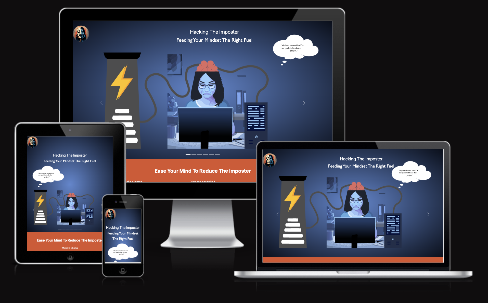

# Hacking The Imposter

## User Experience (UX)

---

-   ### User stories

    -   #### As a user I need to
        - I need to find video sources to fight Impostor Syndrome.
        - I need to find a podcast that I can listen to deal with the Impostor Syndrome.
        - I need inspirational quotes.

-   ### Design
    -   #### Colour Scheme
        The main colours used throughout the page are white, pink and orange. This was made to maintain a relaxing  environment that will soothe the users while they tackle the Impostor Syndrome.
    
    -   #### Imagery
        -   Images of women smilling were used to symbolize a confident state of mind and celebreties were portrayed along their quotes to cement the idea of beating the Impostor Syndrome
    
-   ### Wireframes
   
    You can access the wireframes document by clicking [Here](https://github.com/phillywhitty/hackathon_women_in_tech/blob/main/docs/wireframes/main_page.png).

## Features

---

-  ### Features
    - Header with inspirational message.
    - Youtube videos providing techniques and help to combat impostor syndrome.
    - Spotify section with hosts debating around the topic of impostor syndrome.
    - Testimonials and inspirational quotes from celebrities.
    - Footer with the credits of the authors along with inspirational messages. 

## Technologies Used

---

### Languages Used

-   [HTML5](https://en.wikipedia.org/wiki/HTML5)
-   [CSS3](https://en.wikipedia.org/wiki/Cascading_Style_Sheets)

### Frameworks, Libraries & Programs Used

1. [W3 Validator](https://validator.w3.org)
    - Used to validate HTML and CSS files.
1. [Chrome DevTools](https://developer.chrome.com/docs/devtools/)
    - Chrome's DevTools were used throughout the project to test the layout and make the necessary adjustments.
1. [Google Fonts](https://fonts.google.com)
    - Google fonts were used to import the 'Monoton' and 'Righteous' fonts.
1. [Font Awesome](https://fontawesome.com)
    - Font Awesome was used to add icons like the ones used in the add remove buttons, and the tutorial floating action button.
1. [Git](https://git-scm.com)
    - Git was used for version control by utilizing the Gitpod terminal to commit to Git and Push to GitHub.
1. [GitHub](https://github.com)
    - GitHub is used to store the project's code after being pushed from Git.
1. [Am I responsive](http://ami.responsivedesign.is/)
    - Used to efficiently test different responsive layouts and provide the header image in the readme file.
1. [Dillinger](http://dillinger.io)
    - Markdown editor used to create the readme file.

## Testing

---

### Validation

The W3C Markup Validator, and W3C CSS Validator Services were used to validate and test every page and file of the project to ensure there were no errors. 

-   [W3C Markup Validator](https://validator.w3.org/#validate_by_input) 
    >   Document checking completed. No errors or warnings to show.
-   [W3C CSS Validator](https://jigsaw.w3.org/css-validator/#validate_by_input)
    >   Congratulations! No Error Found.

### Testing User Stories from User Experience (UX) Section

---

-   #### As a user I need to:

    - I need to find sources to fight impostor syndrome.
        > I can watch 3 different youtube videos that can help me.

    - I need to find a podcast that I can listen to deal with the Impostor Syndrome.
        > I can listen to one of the episodes of the Impostor Syndrome Files and also access their whole content with the link below.
    
    - I need inspirational quotes.
        > I can find inspirational quotes from people from all walks of life.

## Deployment

---

### Deployment to GitHub Pages

The project was deployed to [GitHub Pages](https://pages.github.com/) by automatically deploying from [GitHub](https://github.com) using the following steps:

1. Make sure the branch you want to use as your publishing source already exists in your repository.

1. On GitHub, navigate to your site's repository.

1. Under your repository name, click  Settings. If you cannot see the "Settings" tab, select the  dropdown menu, then click Settings.

1. Screenshot of a repository header showing the tabs. The "Settings" tab is highlighted by a dark orange outline.

1. In the "Code and automation" section of the sidebar, click  Pages.

1. Under "Build and deployment", under "Source", select Deploy from a branch.

1. Under "Build and deployment", use the branch dropdown menu and select a publishing source. Screenshot of Pages settings in a GitHub repository. A menu to select a branch for a publishing source, labeled "None," is outlined in dark orange.

1. Optionally, use the folder dropdown menu to select a folder for your publishing source. Screenshot of Pages settings in a GitHub repository. A menu to select a folder for a publishing source, labeled "/(root)," is outlined in dark orange.

1. Click Save.

    
## Credits

---

### Code
-   [Alexander Grib](https://github.com/alexandergrib)

-   [Juan Bracho](https://github.com/JuanBrachoDev) 

-   [Devan Cadman](https://github.com/devancadman) 

-   [Patricia Höge](https://github.com/patthoege) 

-   [Philip Whitty](https://github.com/phillywhitty) 

### Sources
-   [Markdown Guide](https://www.markdownguide.org) As a guide to create the readme file.
-   [Code Institute](https://codeinstitute.net) As a general point of reference.
-   [Stack Overflow](https://stackoverflow.com) As a general point of reference.
-   [W3Schools](https://www.w3schools.com) As a general point of reference.

### Media

-  [The Impostor Syndrome Files - Kim Meninger](https://open.spotify.com/show/6UiI9aXru2XnnV1fY4gbKA) 
-  [The Surprising Solution to the Imposter Syndrome | Lou Solomon | TEDxCharlotte](https://www.youtube.com/watch?v=whyUPLJZljE) 
-  [Michelle Obama explains imposter syndrome](https://www.youtube.com/embed/dumm_XfHkmY) 
-  [Never Gonna Give You Up - Rick Astley](https://www.youtube.com/watch?v=dQw4w9WgXcQ) 

### Acknowledgements

-   Andrew Dempsey for his constant support during the development process.
